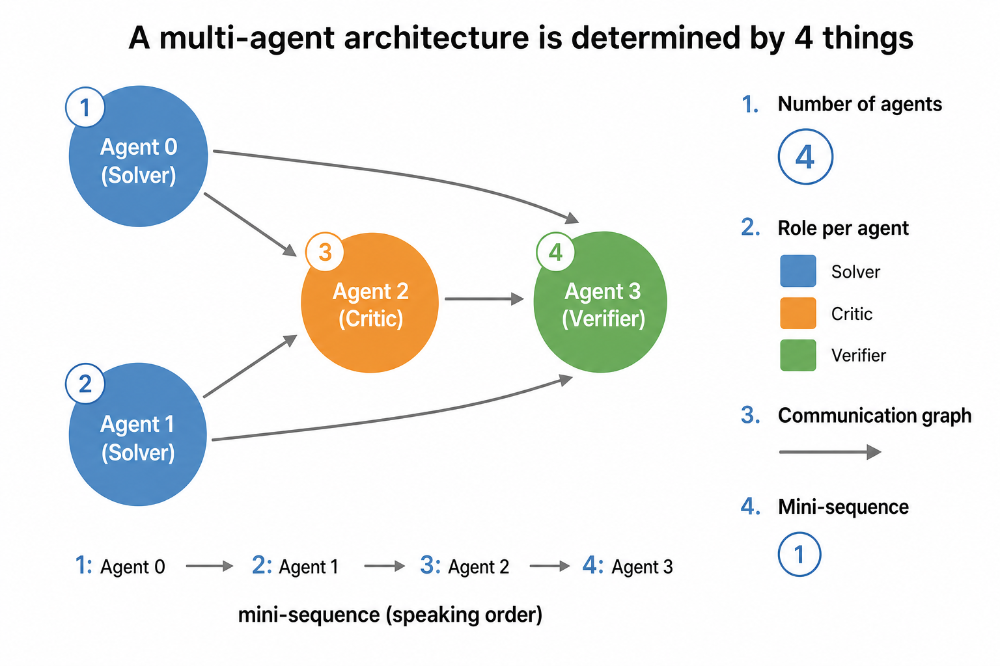

# APO — Architecture Policy Optimization

学一个 task-conditioned 的多智能体架构分布。Head 是个小 LM (Qwen3-0.6B)，输出 4 个 typed 概率分布；worker 是 OpenAI-compatible API（DeepSeek-V3 默认）。整个项目只训练 head。



## 文档

- [`STORY.md`](STORY.md) — 现有工作 + 局限 + 我们的位置
- [`METHOD.md`](METHOD.md) — head / sampler / executor / 训练公式

## 安装

```bash
bash scripts/00_setup_env.sh        # conda env + deps + editable install
conda activate arch_policy
python scripts/02_smoke_test.py     # 24 PASS, no GPU / no API
python scripts/01_download_models.py  # Qwen3-0.6B (~1.2 GB)
```

配 worker（DeepSeek 或任何 OpenAI-compatible）：

```bash
export OPENAI_API_KEY="sk-..."
export OPENAI_BASE_URL="https://api.deepseek.com/v1"
```

## 跑

```bash
# Stage 1 SFT (本地训练，~1 hour 单卡)
python scripts/03_run_sft.py \
  --tasks_source gsm8k --n_tasks 1500 --epochs 5 \
  --device cuda:0 --out_dir checkpoints/sft

# Stage 2 GRPO (烧 worker API)
python scripts/06_run_grpo.py \
  --head_ckpt checkpoints/sft/head_step100 \
  --dataset gsm8k --n 200 --G 4 --epochs 2 \
  --worker openai --worker_model deepseek-chat \
  --out_dir checkpoints/grpo

# Eval
python scripts/05_evaluate.py \
  --mode head --head_ckpt checkpoints/grpo/head_grpo_final \
  --dataset gsm8k --n 200 \
  --worker openai --worker_model deepseek-chat \
  --out_jsonl results/apo_gsm8k.jsonl

# Inspect head outputs on a few sample tasks
python scripts/04_inspect_head.py --ckpt checkpoints/sft/head_step100
```

## Layout

```
src/arch_policy/
  config.py                 ArchSpec / ModelSpec / TrainSpec
  architecture/
    spec.py                 ArchLogits, ArchTargets typed dataclasses
    sampler.py              sample_arch + Plackett-Luce + 4 typed log_prob
    library.py              30+ NamedArch prototypes (7 roles)
    encoder.py              NamedArch → ArchTargets
  head/model.py             latent agent embedding + 4 typed heads
  executor/
    prompts.py              7 role prompts + ReAct + Synth
    tools.py                python_exec / sympy_check / web_search
    agent.py                ReAct inner loop
    synth.py                ANSWER:/CONTINUE judge
    multi_agent.py          main exec loop
    openai_worker.py        DeepSeek / OpenAI API worker
  data/                     GSM8K / MATH / HumanEval loaders + SFT dataset
  reward/                   composite reward + family-aware grader
  training/
    sft.py                  4 typed losses (BCE+CE+BCE+PL-NLL)
    grpo.py                 typed log_pi + entropy bonus, no KL
  baselines.py              10 fixed-topology baselines

scripts/
  00_setup_env.sh           conda env
  01_download_models.py     pull Qwen3-0.6B
  02_smoke_test.py          24 CPU smoke tests
  03_run_sft.py             Stage-1
  04_inspect_head.py        decode head outputs
  05_evaluate.py            baseline / head eval
  06_run_grpo.py            Stage-2

tests/                      24 unit tests
configs/default.yaml        config snapshot
```
