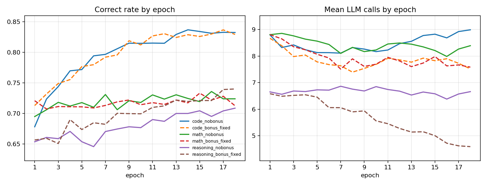
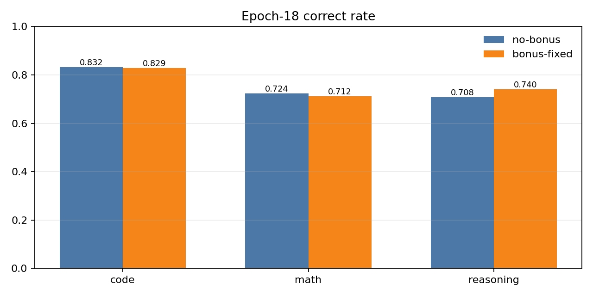
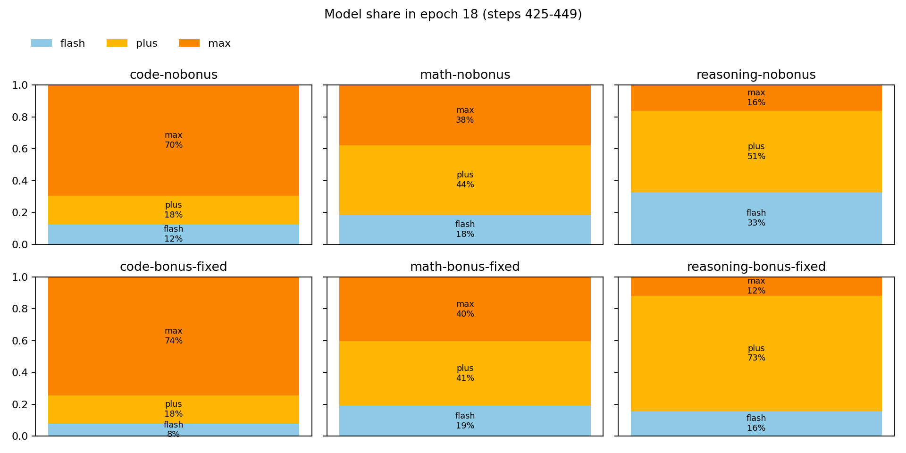
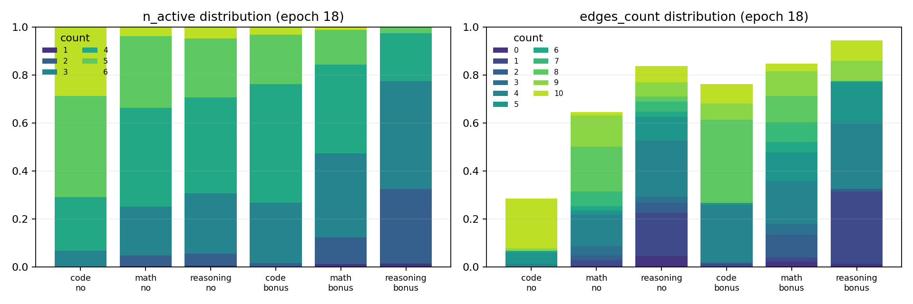

# APO 六实验最终报告：No-bonus vs Bonus-fixed

生成日期：2026-06-22

本报告基于 `results/summary/apo_six_epoch_summary.json` 自动整理，覆盖 3 个任务类别 × 2 种 reward 变体共 6 个训练实验。所有主要指标和架构统计均按 epoch 聚合；最终指标使用第 18 个 epoch（steps 425–449）的均值。

## 1. 实验矩阵与统计口径

每个实验训练 18 epochs。每个 epoch 对应 25 个 GRPO steps；单 step 是 mini-batch 口径，波动较大，因此本报告不比较单个 step，只比较 epoch 级均值。

- `no-bonus`：`cost_bonus_scale=0`。
- `bonus-fixed`：`cost_bonus_scale=0.5`，bonus 只在 mixed group 的正确样本内部按 `n_calls` 起 tie-break；全对组 advantage 为 0。

| 类别 | no-bonus | bonus-fixed |
|---|---|---|
| Code（代码） | `code_nobonus` | `code_bonus_fixed` |
| Math（数学） | `math_nobonus` | `math_bonus_fixed` |
| Reasoning（推理） | `reasoning_nobonus` | `reasoning_bonus_fixed` |

## 2. 完成状态与健康检查

6 个实验均完成 18 epochs / 450 GRPO steps，并均生成 `head_grpo_step450`。`details.jsonl` 坏行均为 0，第 18 epoch 的 API error 均为 0。

| Run | epochs | steps | ckpt450 | epoch18 correct | epoch18 n_calls | epoch18 n_active | epoch18 api | bad_json |
|---|---:|---:|---:|---:|---:|---:|---:|---:|
| `code_nobonus` | 18 | 450 | yes | 0.832 | 8.99 | 4.93 | 0 | 0 |
| `code_bonus_fixed` | 18 | 450 | yes | 0.829 | 7.52 | 3.99 | 0 | 0 |
| `math_nobonus` | 18 | 450 | yes | 0.724 | 8.39 | 4.07 | 0 | 0 |
| `math_bonus_fixed` | 18 | 450 | yes | 0.712 | 7.59 | 3.56 | 0 | 0 |
| `reasoning_nobonus` | 18 | 450 | yes | 0.708 | 6.66 | 3.97 | 0 | 0 |
| `reasoning_bonus_fixed` | 18 | 450 | yes | 0.740 | 4.59 | 2.91 | 0 | 0 |

## 3. Epoch 级训练曲线

图中每个点为一个 epoch 内 25 个 step 的均值。

## 4. 第 18 epoch：正确率与调用数

| 类别 | no-bonus correct | bonus-fixed correct | Δ correct | no-bonus calls | bonus-fixed calls | Δ calls |
|---|---:|---:|---:|---:|---:|---:|
| Code（代码） | 0.832 | 0.829 | -0.003 | 8.99 | 7.52 | -1.47 |
| Math（数学） | 0.724 | 0.712 | -0.011 | 8.39 | 7.59 | -0.81 |
| Reasoning（推理） | 0.708 | 0.740 | +0.031 | 6.66 | 4.59 | -2.07 |

按第 18 epoch 均值，bonus-fixed 在三类中均降低平均 `n_calls`：code 约 -1.47，math 约 -0.80，reasoning 约 -2.07。

## 5. 第 18 epoch：架构分布

以下模型、role、n_active、edges_count 与 top family 均使用第 18 epoch（steps 425–449）的采样架构统计。

### 5.1 模型选择

| Run | epoch18 model share (flash / plus / max) |
|---|---|
| `code_nobonus` | flash 12.3% / plus 18.2% / max 69.5% |
| `code_bonus_fixed` | flash 7.7% / plus 17.8% / max 74.4% |
| `math_nobonus` | flash 18.4% / plus 43.8% / max 37.8% |
| `math_bonus_fixed` | flash 18.9% / plus 40.6% / max 40.5% |
| `reasoning_nobonus` | flash 32.7% / plus 51.2% / max 16.1% |
| `reasoning_bonus_fixed` | flash 15.6% / plus 72.6% / max 11.8% |

### 5.2 Active agent 与通信边

| Run | n_active 主分布 | edges_count 主分布 |
|---|---|---|
| `code_nobonus` | 5个 42.3%；6个 28.6%；4个 22.4%；3个 6.5% | 17条 39.4%；26条 27.4%；10条 20.8%；5条 4.9% |
| `code_bonus_fixed` | 4个 49.7%；3个 25.1%；5个 20.6%；6个 3.1% | 8条 34.8%；4条 23.9%；16条 12.3%；10条 8.0% |
| `math_nobonus` | 4个 41.3%；5个 30.0%；3个 20.4%；2个 4.4% | 8条 18.6%；15条 16.5%；9条 13.2%；4条 13.0% |
| `math_bonus_fixed` | 4个 36.9%；3个 35.1%；5个 14.5%；2个 11.1% | 4条 18.0%；5条 11.8%；8条 10.9%；9条 10.4% |
| `reasoning_nobonus` | 4个 40.1%；3个 25.2%；5个 24.4%；2个 5.1% | 4条 23.4%；1条 18.0%；5条 9.9%；10条 6.8% |
| `reasoning_bonus_fixed` | 3个 45.0%；2个 31.3%；4个 20.0%；5个 2.4% | 1条 30.2%；4条 27.7%；5条 16.6%；10条 8.5% |

### 5.3 Role 组成

| Run | epoch18 top roles |
|---|---|
| `code_nobonus` | Solver 48.7%；Refiner 28.7%；Verifier 14.6%；Expert 2.3%；Critic 1.9% |
| `code_bonus_fixed` | Solver 70.8%；Refiner 17.4%；Verifier 6.2%；Expert 1.8%；Planner 1.5% |
| `math_nobonus` | Solver 44.7%；Verifier 18.6%；Refiner 14.0%；Tester 7.3%；Critic 4.8% |
| `math_bonus_fixed` | Solver 47.9%；Refiner 17.1%；Verifier 15.8%；Tester 6.0%；Critic 4.9% |
| `reasoning_nobonus` | Solver 39.9%；Verifier 18.8%；Refiner 15.1%；Expert 8.6%；Tester 6.3% |
| `reasoning_bonus_fixed` | Solver 68.4%；Refiner 15.4%；Verifier 11.6%；Critic 1.7%；Tester 1.3% |

## 6. 第 18 epoch 最常见 architecture family

### `code_nobonus`

| family | n_active | edges | count |
|---|---:|---:|---:|
| `Refiner[max] + Solver[max] + Solver[max] + Solver[max]` | 4 | 10 | 22 |
| `Refiner[max] + Refiner[plus] + Solver[max] + Solver[max] + Solver[max]` | 5 | 17 | 21 |
| `Refiner[max] + Solver[max] + Solver[max] + Solver[max] + Verifier[max]` | 5 | 17 | 16 |
| `Refiner[max] + Solver[max] + Solver[max] + Verifier[max]` | 4 | 10 | 15 |
| `Refiner[max] + Refiner[max] + Solver[max] + Solver[max] + Solver[max] + Verifier[max]` | 6 | 26 | 14 |

### `code_bonus_fixed`

| family | n_active | edges | count |
|---|---:|---:|---:|
| `Solver[max] + Solver[max] + Solver[max]` | 3 | 4 | 128 |
| `Solver[max] + Solver[max] + Solver[plus]` | 3 | 4 | 79 |
| `Refiner[max] + Solver[max] + Solver[max] + Solver[max]` | 4 | 8 | 54 |
| `Solver[max] + Solver[max] + Solver[max] + Solver[max]` | 4 | 8 | 41 |
| `Solver[max] + Solver[max] + Solver[max] + Verifier[max]` | 4 | 8 | 37 |

### `math_nobonus`

| family | n_active | edges | count |
|---|---:|---:|---:|
| `Solver[max] + Solver[max] + Solver[plus]` | 3 | 4 | 6 |
| `Solver[max] + Solver[plus] + Solver[plus]` | 3 | 4 | 6 |
| `Solver[max] + Solver[plus] + Verifier[max]` | 3 | 4 | 4 |
| `Solver[max] + Solver[plus] + Verifier[plus]` | 3 | 4 | 4 |
| `Solver[plus] + Tester[plus]` | 2 | 1 | 4 |

### `math_bonus_fixed`

| family | n_active | edges | count |
|---|---:|---:|---:|
| `Solver[max] + Solver[plus]` | 2 | 2 | 22 |
| `Solver[max] + Solver[max]` | 2 | 2 | 12 |
| `Refiner[max] + Solver[max] + Solver[plus]` | 3 | 4 | 10 |
| `Solver[plus] + Solver[plus]` | 2 | 2 | 10 |
| `Solver[max] + Solver[max] + Solver[plus]` | 3 | 4 | 8 |

### `reasoning_nobonus`

| family | n_active | edges | count |
|---|---:|---:|---:|
| `Solver[flash] + Solver[plus] + Verifier[plus]` | 3 | 1 | 16 |
| `Solver[flash] + Solver[plus] + Solver[plus]` | 3 | 1 | 9 |
| `Solver[flash] + Solver[max] + Solver[plus]` | 3 | 1 | 8 |
| `Solver[plus] + Solver[plus]` | 2 | 0 | 7 |
| `Solver[flash] + Solver[flash]` | 2 | 0 | 6 |

### `reasoning_bonus_fixed`

| family | n_active | edges | count |
|---|---:|---:|---:|
| `Solver[plus] + Solver[plus]` | 2 | 1 | 338 |
| `Solver[flash] + Solver[plus]` | 2 | 1 | 48 |
| `Solver[plus] + Solver[plus] + Verifier[plus]` | 3 | 4 | 48 |
| `Refiner[max] + Solver[plus] + Solver[plus]` | 3 | 4 | 45 |
| `Solver[plus] + Solver[plus] + Verifier[flash]` | 3 | 4 | 45 |

## 7. 复核路径

| 内容 | 路径 |
|---|---|
| epoch 级统计 | `results/summary/apo_six_epoch_summary.json` |
| 6 实验 summary | `results/summary/apo_six_experiment_data.json` |
| 每个实验 history | `results/<run>/history.json` |
| 每个实验 per-trace details | `results/<run>/details.jsonl` |
| 代码 | `src/arch_policy/` |
| 数据 | `data/categories/` |
| 图 | `results/figures/` |

## 8. 口径说明

- 本报告的所有主要结果与架构统计均按第 18 epoch 聚合；不比较单个 step，也不使用跨 epoch 边界的 final-N step 口径。
- 本报告使用 training/on-policy 指标，不包含 held-out test evaluation。
- `details.jsonl` 记录 `edges_count`，不保存完整 edge matrix。
- 训练 checkpoint 未放入 GitHub repo，但服务器上每个实验均保留 `head_grpo_step450` 与中间每 25 step 的 checkpoint。
